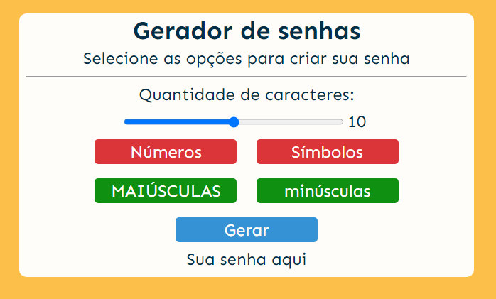

# Gerador de Senhas

## Como iniciar o projeto ❔
- Clone o repósito
- Abra a pasta do projeto no VS Code
- Abra o terminal e digite 'npm run dev'
- Execute o arquivo index.html
  * É necessário ter o NodeJS instalado

## ⚙ Tecnologias

- HTML
- CSS
- JavaScript

## 👨‍💻 Contato

sguedes.victor@gmail.com

## 💻 LinkedIn

https://www.linkedin.com/in/victorsilvaguedes/
